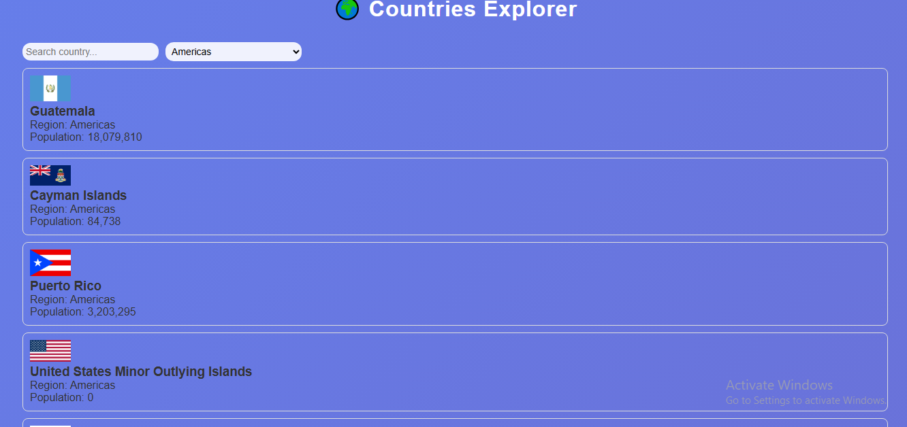
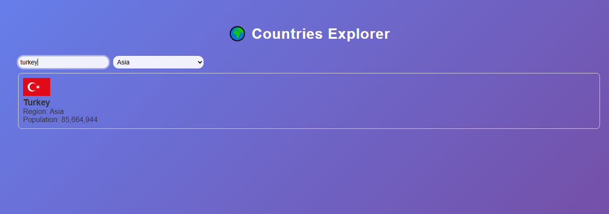

# 🌍 Countries Explorer

This app allows users to explore country data using the REST Countries API.

---

## 🚀 How to Run the Project

1. Clone the repository:
   git clone https://github.com/Muzhi2000/Country-explorer.git

2. Navigate into the folder:
   cd Country-eplorer

3. Install dependencies:
   npm install

4. Start the development server:
   npm run dev

---

## 🌐 API Endpoints Used

All countries:
https://restcountries.com/v3.1/all

Search by name:
https://restcountries.com/v3.1/name/{name}

Filter by region:
https://restcountries.com/v3.1/region/{region}

---

## 📸 Screenshots

### 🏠 Home Page

### 🔎 Result Page

